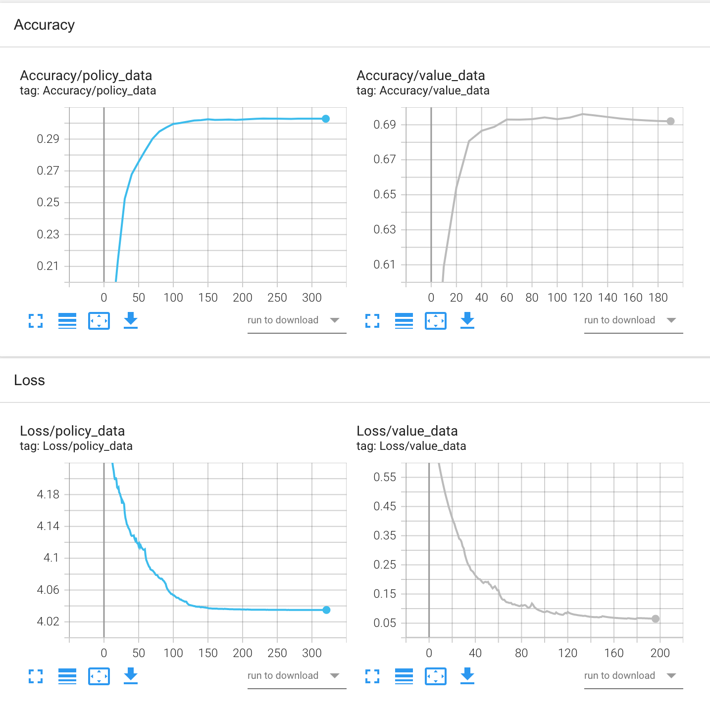

# AlphaGo

This repo contains a partial implementations of AlphaGo, without the self-playing RL loop.

## Work Done

- Online recovery of a pro go game with a 9*9 board
- Playback of games and extraction of manual features, outputs and data augmentation for the value and policy network (~190 000 data).
- Creation of a convolutional neural network `FeatureExtractor` to extract the features of the go game
- Creation of two neural networks PolicyNetwork and ValueNetwork which are built on top of the `FeatureExtractor`.
- Trained the PolicyNetwork, and achieved 30% accuracy on the test dataset
- Fine-tuning the ValueNetwork from the weights of the FeatureExtractor block of the previously trained PolicyNetwork and achieving 70% accuracy
- Modification of the MCTS to use the ValueNetwork to evaluate a game board, and the PolicyNetwork for rollouts

Due to lack of time we could not go further, and we do not beat GNUGo.

## To go further

- Search for good hyperparameters for MCTS.
- Implement the reinforcement learning part.

## NN Training results

## Important files

- `src/weigths`: Pre-trained weights for policy and value network.
- `src/alphaPlayer.py`: The AlphaGo player. You can run `python named_game.py alphaPlayer.py randomPlayer.py` to test it.
- `src/feature_extraction.py`: All the code related to the data collection and manipulation.
- `src/net.py`: Neural Networks architecture and training.

